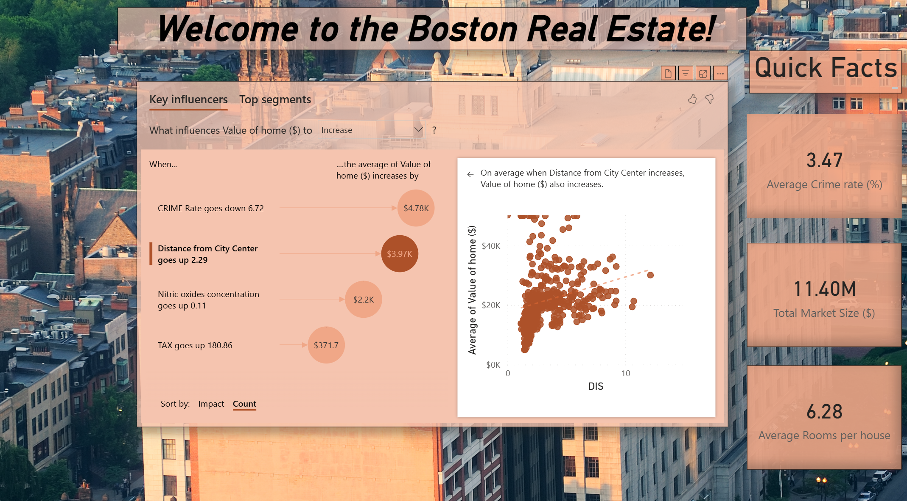

# power_bi

This repository provides **basic dashboard examples** to explore interactive data visualization with Power BI. It includes sample datasets, example `.pbix` dashboard files.

### Repository Structure

- `reports` — .pbix files for dashboards
- `Data` — the dataset used for analysis and charts.
- `docs/` — sample dashboard images

### Usage

- Download the .pbix file(s) from the `reports` folder.
- Open the fle in Microsoft Power BI. The file should link directly to the remote dataset on GitHub.

## Boston_Housing_market_Introduction_Dashboard

**Boston_Housing_market_Introduction_Dashboard** is an introductory-level project. This dashboard uses a filtered version of the popular Boston Housing data from Kaggle to provide insights into the Boston Real Estate market of the 1970's.

### Troubleshooting

- In case the dataset does not load automatically, please update the link to the remote dataset in the `.pbix` file.

